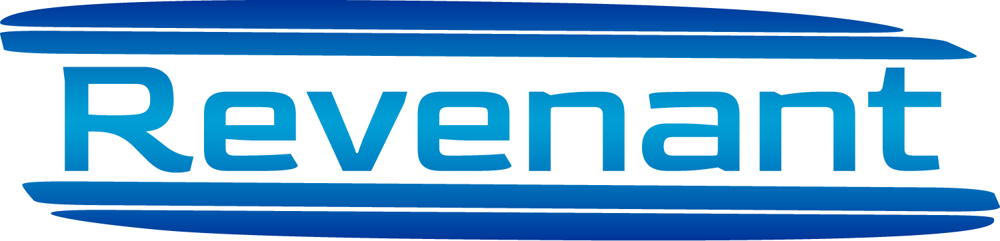

# Revenant: Advanced Lua framework for LGS profiles

The goal is simple: A way to utilize the full power of Logitech's lua scripting feature without having to wrestle with the awkward API, usable even for anyone without much lua programming experience.

```lua
local profile = ...
local k = profile.key

profile.config = { devices="G600", monitors={1920,1080} }


k.m3 = "/3"
```

## Bind anything to any button:
- 28 Macro Types for pretty much anything you could want your mouse to do.
- Bind multiple macros one key.
- Select different Macros to execute via button cycling, multi-clicks, hold time and other conditions.

## Positioning controls:
- Modify key bindings based on specific areas of your monitor(s).
- Move your mouse anywhere instantaneously or over time.

## Easily Customizable
- Define your own key and mode names, make your mouse your own.
- Group bindings by keys, modes, g-shift states
- Easily integrate custom lua functions.

## Designed to be user friendly:
- Fully featured linter and type checker for profiles.
- VSCode integration with intellisense and detailed annotations.

## Fully asynchronous:
- Multiple key sequences can run at the same time.
- Running sequences can be dynamically cancelled paused and resumed.

## Easily Manage any number of modes:
- Support for Device dependent or independent modes
- can synchronize to hardware modes and supports backlight on certain (non lightsync) Logitech devices.

## Macros as Dynamic Components:
- A macro can be nested in, linked to and extended from other macros.
- Build macro chains and logical conditions without any lua or logitech API knowledge.

## Hierarchical Class-like Profiles:
- Dynamically inherit and extend profiles from another Profile
- support for multiple inheritance
- Configuration and documentation files are inheritable as well

## Easy Monitoring
- Profiles and Modes are automatically integrated with your Logitech LCD Displays
- Documentation mode for quickly displaying macro functionality
- Also works with the LGS LCD Emulator.


# Installation
1. Create a new LGS profile and delete all the standard lgs bindings (Left and right mouse button stay bound by default)

2. Download the latest release of Revenant from the releases section and unpack it. For the quickest start unpack it into the install location of LGS

3. In the `start` folder of Revenant copy the contents of the `LGS_Template.lua` file and paste it into the lua scripting section of the LGS profile. [If you put it into any other folder than your LGS installation, you will have to adjust the values of the `rv.path` and `rv.configPath` values]

...That's all you need to start defining macros and tweaking your profile, however it's generally more practical to use external profile files.

To set up an external profile simply change the `rv.externalProfile` setting in the LGS script to `true`, copy the `reference_profile.lua` file from the `start` directory into the `profiles` directory and rename it according to the `rv.profileName` property.

# Quickstart: bindings

## Configuring